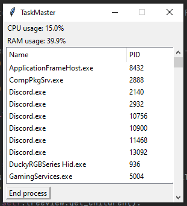

# TaskMaster
TaskMaster allows you to to manage tasks running on your PC, as well as see your current CPU and RAM usage.

It currently allows you to see your CPU and RAM usage, as well as a list of currently running processes, which can be sorted by name or PID. You can also end a selected process.

## Setup
The latest release can be downloaded from [here](https://github.com/HazNut/TaskMaster/releases/latest).

You can either download the zip file, which contains an .exe and everything you will need to run the program.

Or, you can download the source, either from the release or from cloning the repo. The repo will have the latest code but is not guaranteed to be stable. If you have Python 3 and pip installed, you can run setup.bat to install all required dependencies from requirements.txt. Then, just run taskmaster.pyw.
