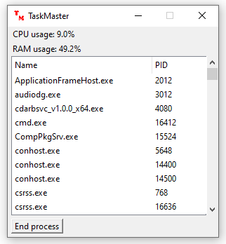

# TaskMaster
TaskMaster allows you to to manage tasks running on your PC, as well as see your current CPU and RAM usage.

It currently allows you to see your CPU and RAM usage, as well as a list of currently running processes, which can be sorted by name or PID. You can also end a selected process.

## Setup
The latest release can be downloaded from [here](https://github.com/HazNut/TaskMaster/releases/latest).

Make sure you install Python 3 - this release has been tested on Python 3.7, 3.8 and 3.9.

Unzip the release and run setup.bat, which will install all required dependencies from requirements.txt.

Then, just run taskmaster.py.
